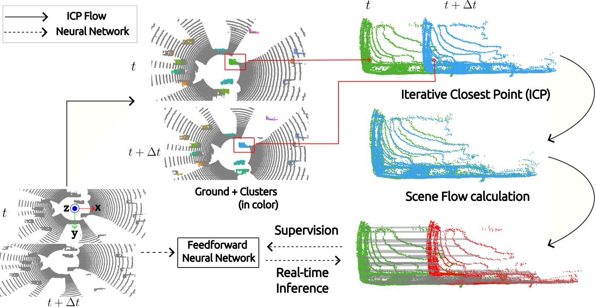

# ICP-Flow: LiDAR Scene Flow Estimation with ICP

Official implementation: [ICP-Flow: LiDAR Scene Flow Estimation with ICP](https://arxiv.org/abs/2402.17351) (CVPR 2024) 

[Yancong Lin](https://yanconglin.github.io/) and [Holger Caesar](https://sites.google.com/it-caesar.de/homepage/).

Delft University of Technology, The Netherlands.

## Introduction
Scene flow characterizes the 3D motion between two LiDAR scans captured by an autonomous vehicle at nearby timesteps. Prevalent methods consider scene flow as point-wise unconstrained flow vectors that can be learned by either large-scale training beforehand or time-consuming optimization at inference. However, these methods do not take into account that objects in autonomous driving often move rigidly. We incorporate this rigid-motion assumption into our design, where the goal is to associate objects over scans and then estimate the locally rigid transformations. We propose ICP-Flow, a learning-free flow estimator. The core of our design is the conventional Iterative Closest Point (ICP) algorithm, which aligns the objects over time and outputs the corresponding rigid transformations. Crucially, to aid ICP, we propose a histogram-based initialization that discovers the most likely translation, thus providing a good starting point for ICP. The complete scene flow is then recovered from the rigid transformations. We outperform state-of-the-art baselines, including supervised models, on the Waymo dataset and perform competitively on Argoverse-v2 and nuScenes. Further, we train a feedforward neural network, supervised by the pseudo labels from our model, and achieve top performance among all models capable of real-time inference. We validate the advantage of our model on scene flow estimation with longer temporal gaps, up to 0.4 seconds where other models fail to deliver meaningful results.

## Main feature

  
 Ground Segmentation + Clustering + Iterative Closest Point (ICP)
 
## Reproduction

### Bug fix:

A bug fixed on 01-05-2024; tested locally.

### Installation

1. Conda env setup.

```bash
conda create -f environment.yml
conda activate icp_flow
```
2. Install [Patchwork++](https://github.com/url-kaist/patchwork-plusplus) for ground segmentation.

There are several modifications on top of the original Patchwork++ to output point indices.

```bash
# To install Eigen
$ sudo apt-get install libeigen3-dev

# To install Patchwork++
$ cd patchwork-plusplus
$ mkdir build && cd build
$ cmake ..
$ make
```

Note: This version requires a GPU. The CPU-only version has not been released yet.

### Dataset

1. Waymo and nuScenes: see [Dynamic 3D Scene Analysis by Point Cloud Accumulation](https://github.com/prs-eth/PCAccumulation) for details.

```bash
wget --no-check-certificate --show-progress https://share.phys.ethz.ch/~gsg/PCAccumulation/data.zip
unzip data.zip
```

2. Argoverse-v2: see [ZeroFlow: Scalable Scene Flow via Distillation](https://github.com/kylevedder/zeroflow) for details.

   For simplicity, I took a different approach to load data: run ZeroFlow on the val/test set, and then save the points/labels in a .npz file per sample.
   See [dataset_argo.py](dataset_argo.py) for details.

   Alternatively, you may also load pretrained checkpoints (see below) to ZeroFlow and test on Argoverse-v2 using the ZeroFlow codebase. 
   

### Test ICP-Flow
Configure all variables beforehand within the *.sh files. You may find all results at [SURFdrive](https://surfdrive.surf.nl/files/index.php/s/AqrrbdMV6hnELpW). 

```bash
bash main.sh
```

### ICP-Flow + FNN

ICP-Flow + FNN has an identical design to ZeroFlow. You may download pre-trained weights from [SURFdrive](https://surfdrive.surf.nl/files/index.php/s/AqrrbdMV6hnELpW). 

### Demo

```Bash
bash demo.sh
```

### Argoverse-v2 Scene Flow Challenge

Please refer to the [leaderboard](https://eval.ai/web/challenges/challenge-page/2210/leaderboard).  

### Acknowledge

Many thanks to the authors of ZeroFlow and Point Cloud Accumulation.

### Citation
```bash
@article{lin2024icp,
  title={ICP-Flow: LiDAR Scene Flow Estimation with ICP},
  author={Lin, Yancong and Caesar, Holger},
  booktitle={Proceedings of the IEEE/CVF Conference on Computer Vision and Pattern Recognition (CVPR)},
  year={2024}
}
```
